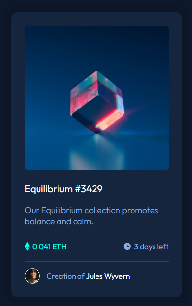

# NFT Preview Card Component

Este é um desafio da [Frontend Mentor](https://www.frontendmentor.io) que consiste em criar um componente de cartão de pré-visualização de NFT. O objetivo é praticar habilidades de HTML e CSS, além de garantir que o layout seja responsivo e fiel ao design proposto.

## Índice

- [Visão Geral](#visão-geral)
  - [O Desafio](#o-desafio)
  - [Screenshot](#screenshot)
  - [Links](#links)
- [Meu Processo](#meu-processo)
  - [Tecnologias Utilizadas](#tecnologias-utilizadas)
  - [O que Aprendi](#o-que-aprendi)
  - [Desafios Encontrados](#desafios-encontrados)
- [Como Executar o Projeto](#como-executar-o-projeto)
- [Autor](#autor)

## Visão Geral

### O Desafio

O desafio consiste em criar um componente de cartão de pré-visualização de NFT que seja responsivo e siga o design fornecido. O layout deve ser o mais próximo possível do design original, e a interatividade deve ser implementada conforme as especificações.

**Requisitos:**
- Exibir uma imagem do NFT com um efeito de hover.
- Mostrar informações como o nome do NFT, descrição, preço em ETH e tempo restante para o leilão.
- Exibir o avatar do criador e seu nome.
- Aplicar efeitos de hover nos elementos interativos (título e nome do criador).

### Screenshot



### Links

- [Solução no Frontend Mentor](https://www.frontendmentor.io/solutions/nft-preview-card-component-using-html-and-css-3JZQZQZQZQ)
- [Live Site](https://cadanieldev.github.io/nft-preview-card/)

## Meu Processo

### Tecnologias Utilizadas

- HTML5
- CSS3
- Flexbox
- Variáveis CSS
- Efeitos de hover com `filter` e `transition`

### O que Aprendi

- Como utilizar variáveis CSS para facilitar a manutenção do código.
- Aplicar efeitos de hover em imagens usando a propriedade `filter`.
- Criar layouts responsivos com Flexbox.
- Utilizar pseudo-elementos para adicionar sobreposições de cor.

### Desafios Encontrados

- Ajustar o efeito de hover na imagem para que a cor de sobreposição fosse consistente.
- Garantir que o layout fosse responsivo em diferentes tamanhos de tela.
- Alinhar os ícones e textos de forma precisa.

## Como Executar o Projeto

1. Clone o repositório:
   ```bash
   git clone https://github.com/seu-usuario/nft-preview-card-component.git